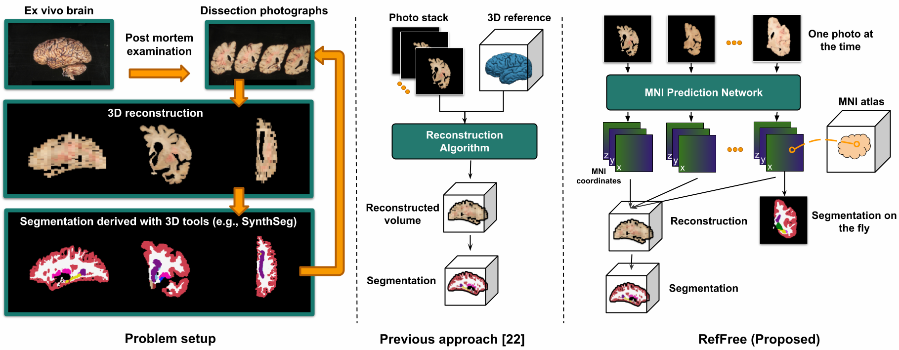
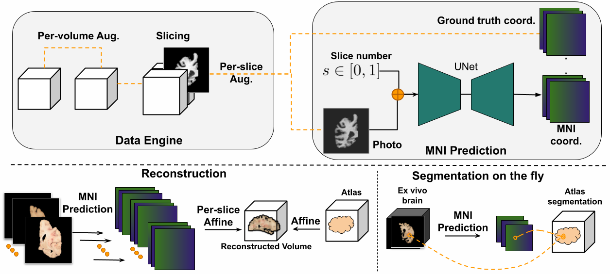

# RefFree: Reference-Free 3D Reconstruction of Brain Dissection Slabs via Learned Atlas Coordinates
[](https://arxiv.org/abs/2503.09963)

**Reference-Free 3D Reconstruction of Brain Dissection Photographs with Machine Learning**  
Lin Tian, Jonathan Williams-Ramirez, Dina Zemlyanker, Lucas J. Deden-Binder, Rogeny Herisse, Theresa R. Connors, Mark Montine, Istvan N Huszar, Lilla Zöllei, Sean I. Young, Christine Mac Donald, C. Dirk Keene, Derek H. Oakley, Bradley T. Hyman, Oula Puonti, Matthew S. Rosen, and Juan Eugenio Iglesias

<div align="center">

</div>

RefFree is a deep learning-based ex vivo brain dissection photograph reconstruction pipeline. It consists of two stages: (1) an MNI coordinate prediction neural network trained with a dissection photograph synthetic data engine and (2) an MNI coordinate-based reconstruction algorithm, as shown below.


<div align="center">

</div>

TODO:
- [ ] Release data processing code

## 👉 Installation
Run the following 
```
conda create -n reffree python==3.9
conda activate reffree

cd reffree
pip install .
```

## 👉 Data preprocessing

## 👉 Training
Before training, create a train_config.py file from configs/train_config_example.py. Update the directory setting in train_config.py.

Train the model with the following command line
```
python src/reffree/train.py -e [EXP_ID] --exp_folder [EXP_FOLDER] --batch_size 2 --slice_num 32 --epoch 100 --train_config ./configs/train_config.py
```

## 📄 Citation
If you find this repository useful, please consider cite:
```
@article{tian2025reference,
  title={Reference-Free 3D Reconstruction of Brain Dissection Slabs via Learned Atlas Coordinates},
  author={Tian, Lin and Williams Ramirez, Jonathan and Zemlyanker, Dina and Deden-Binder, Lucas J. and Herisse, Rogeny and Connors, Theresa R. and Montine, Mark and Huszar, Istvan N. and Z{\"o}llei, Lilla and Young, Sean I. and {Mac Donald}, Christine and Keene, C. Dirk and Oakley, Derek H. and Hyman, Bradley T. and Puonti, Oula and Rosen, Matthew S. and Iglesias, Juan Eugenio},
  journal={arXiv preprint arXiv:2503.09963},
  year={2025}
}
```
